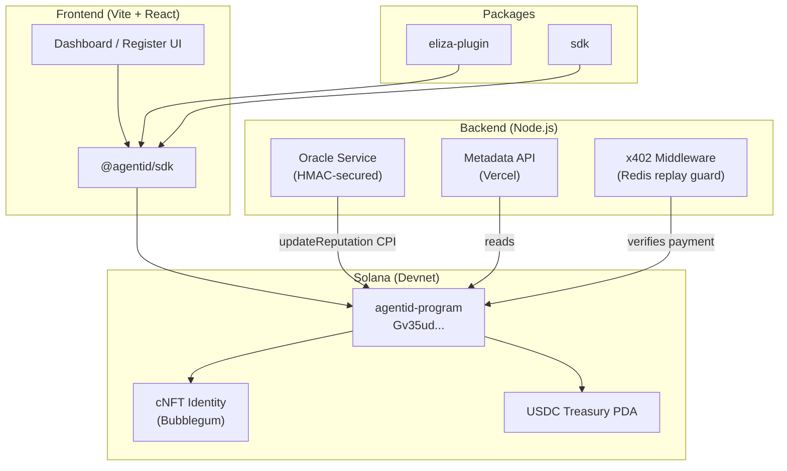

# AgentID — Know Your Agent (KYA) Protocol

> **Live on Solana Devnet** · Open Beta

[](https://explorer.solana.com/address/Gv35udP7tnnVcNiCMLKYeyjx1rfkeos4e6cXsFGr4tcF?cluster=devnet)
[](./frontend/src/test/e2e.test.ts)
[](./docs/security/audit.md)
[](./LICENSE)

AgentID is an open-source, on-chain identity and trust layer for AI agents on Solana. It enables autonomous agents to register verifiable identities (KYA — Know Your Agent), manage USDC treasuries, pay for services via the x402 payment protocol, and accumulate on-chain reputation scores.

---

## ✨ Features

| Feature | Status |
|---|---|
| 🪪 On-chain agent identity (cNFT via Bubblegum) | ✅ Live on devnet |
| 🔍 Agent verification & reputation scoring | ✅ Live on devnet |
| 💰 USDC treasury with spending limits | ✅ Live on devnet |
| 💸 Autonomous payments (x402 protocol) | ✅ Live on devnet |
| 🔔 Oracle webhooks (HMAC-secured, Helius) | ✅ Live on devnet |
| 🌐 Metadata API (Vercel serverless) | ✅ Live: `agentid-metadata-api.vercel.app` |
| 🤖 ElizaOS plugin | ✅ Published (`packages/eliza-plugin`) |
| 📦 TypeScript SDK | ✅ Published (`packages/sdk`) |

---

## 🚀 Quick Start (5 minutes)

### Prerequisites
- [Solana CLI](https://docs.solanalabs.com/cli/install) ≥ 1.18
- [Anchor CLI](https://www.anchor-lang.com/docs/installation) ≥ 0.30
- [Node.js](https://nodejs.org/) ≥ 18
- A Solana wallet with devnet SOL ([faucet](https://faucet.solana.com))

### 1. Clone & install
```bash
git clone https://github.com/Vishal4742/agentid-kya-solana.git
cd agentid-kya-solana
cd frontend && npm install && cd ..
cd backend && yarn install && cd ..
```

### 2. Configure environment
```bash
cp backend/.env.example backend/.env
cp backend/oracle/.env.example backend/oracle/.env
cp frontend/.env.example frontend/.env.local
# Edit each file and fill in your values
```

### 3. Register your first agent (devnet)
```bash
bash scripts/demo-devnet.sh
```

This script will:
1. Check your wallet balance and Solana CLI config
2. Derive your agent identity PDA from the program
3. Check whether the config PDA and identity PDA exist on-chain
4. Log the treasury PDA and spending limits from the program
5. Fetch metadata from the Vercel metadata API

### 4. Run the frontend
```bash
cd frontend && npm run dev
# Open http://localhost:5173
```

---

## 🏗️ Architecture



---

## 📁 Project Structure

```
agentid-kya-solana/
├── frontend/           # Vite + React + TypeScript UI
│   ├── src/
│   │   ├── pages/      # Dashboard, Register, AgentProfile
│   │   ├── components/ # Reusable UI components
│   │   ├── hooks/      # useAgents, useWallet, etc.
│   │   └── test/       # Vitest E2E + unit tests
├── backend/
│   ├── programs/       # Anchor / Rust program (12 instructions)
│   ├── tests/          # Anchor integration tests
│   ├── api/            # Metadata API (serverless)
│   ├── oracle/         # Oracle webhook service
│   └── x402/           # Payment middleware
├── packages/
│   ├── sdk/            # TypeScript SDK
│   └── eliza-plugin/   # ElizaOS plugin
└── scripts/            # Deploy, demo, and utility scripts
```

---

## 🧪 Running Tests

```bash
# Frontend (Vitest — 30 tests including devnet E2E)
cd frontend && npm test

# Anchor integration tests (requires localnet)
cd backend && anchor test

# x402 middleware unit tests
cd backend/x402 && npm test

# x402 devnet integration (requires funded wallet)
cd backend/x402 && npm run test:integration
```

---

## 📖 Documentation

| Doc | Description |
|---|---|
| [docs/overview/project.md](./docs/overview/project.md) | Product overview and feature roadmap |
| [docs/security/audit.md](./docs/security/audit.md) | Security audit summary and mitigations |
| [docs/operations/deployment.md](./docs/operations/deployment.md) | Step-by-step deployment guide |
| [CONTRIBUTING.md](./CONTRIBUTING.md) | Contribution guidelines |
| [SUPPORT.md](./SUPPORT.md) | Support and escalation paths |

---

## 🛡️ Security

An internal security audit was completed on 2026-04-12. See [docs/security/audit.md](./docs/security/audit.md) for findings and mitigations.

**Report a vulnerability:** Follow [SECURITY.md](./.github/SECURITY.md). Do not disclose critical vulnerabilities publicly.

---

## 🌐 Live Endpoints

| Service | URL |
|---|---|
| **Devnet Program** | [`Gv35udP7tnnVcNiCMLKYeyjx1rfkeos4e6cXsFGr4tcF`](https://explorer.solana.com/address/Gv35udP7tnnVcNiCMLKYeyjx1rfkeos4e6cXsFGr4tcF?cluster=devnet) |
| **Metadata API** | `https://agentid-metadata-api.vercel.app` |
| **Frontend (devnet)** | Deploy to Vercel via `cd frontend && npm run build` |

---

## 🤝 Contributing

See [CONTRIBUTING.md](./CONTRIBUTING.md). Follow [Conventional Commits](https://www.conventionalcommits.org/).

---

## 📄 License

MIT License. See [LICENSE](./LICENSE).
