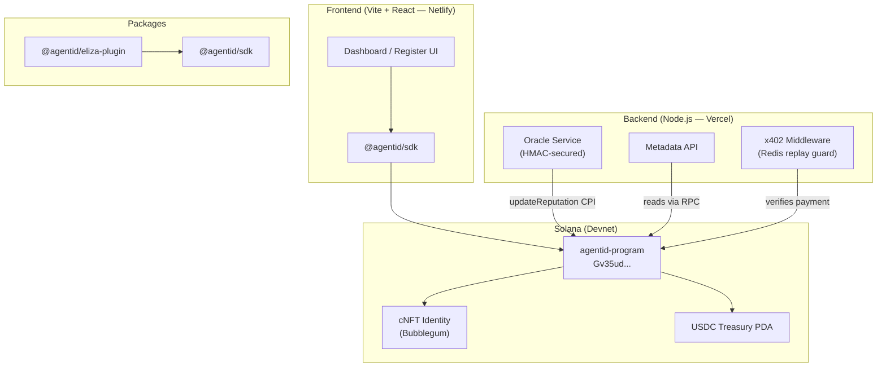

# Architecture — AgentID KYA Protocol

> A deep-dive into how the protocol components fit together, what lives where on-chain, and how data flows through the system.

This document is for developers who want to understand the internals of AgentID — how identity is stored, how reputation is computed, how payments work, and how the off-chain services connect to the on-chain program.

---

## High-Level Component Map



---

## Tech Stack

| Layer | Technology | Version |
|---|---|---|
| Smart contract | Anchor (Rust) | ≥ 0.30 |
| Solana runtime | Solana CLI | ≥ 1.18 |
| NFT minting | Metaplex Bubblegum (cNFT) | v1 |
| Frontend | Vite + React + TypeScript | React 18 |
| Wallet adapter | `@solana/wallet-adapter-react` | latest |
| SDK | TypeScript (`@coral-xyz/anchor`) | latest |
| Backend API | Vercel serverless (TypeScript) | Node 18 |
| Oracle scheduler | GitHub Actions | — |
| Payment middleware | Express + x402 | — |
| Replay protection | Redis (falls back to in-memory) | ≥ 7 |
| Frontend hosting | Netlify | — |
| API hosting | Vercel | — |

---

## On-Chain Program — PDA Layout

Every piece of on-chain state in AgentID is stored in a **Program Derived Address (PDA)** — a deterministic account address derived from fixed seeds and the program ID. No centralized database.

| Account | Seeds | Purpose |
|---|---|---|
| `ProgramConfig` | `["program-config"]` | Singleton: stores admin pubkey and oracle authority. Created once by `init_config`. |
| `AgentIdentity` | `["agent-identity", owner_pubkey]` | One per registered agent. Stores name, capabilities, reputation score, verification level. |
| `AgentAction` | `["agent-action", identity_pubkey, action_count]` | Append-only action log. One per logged action. |
| `AgentTreasury` | `["agent-treasury", identity_pubkey]` | USDC treasury account. Created by `initialize_treasury`. Stores balance, spending limits, pause state. |

### Deriving a PDA (TypeScript)

```ts
import { PublicKey } from "@solana/web3.js";
import { PROGRAM_ID } from "@agentid/sdk";

const [identityPda] = PublicKey.findProgramAddressSync(
  [Buffer.from("agent-identity"), ownerPubkey.toBytes()],
  new PublicKey(PROGRAM_ID)
);
```

---

## Data Flow: From Registration to Reputation

```
1. User connects wallet (Phantom, Backpack, etc.)
        │
2. User fills Register form in frontend
        │
3. Frontend calls sdk.registerAgent()
        │
4. SDK builds transaction with `register_agent` instruction
   - Creates AgentIdentity PDA
   - Mints cNFT via Bubblegum CPI
        │
5. User signs and broadcasts transaction
        │
6. Oracle (GitHub Actions / Helius webhook) picks up the new account
        │
7. Oracle computes reputation score (success rate, ratings, longevity, volume, verification)
        │
8. Oracle calls `update_reputation` on-chain → AgentIdentity.reputation_score updated
        │
9. Metadata API serves updated data at /api/metadata/:agentId
        │
10. Frontend Dashboard reads live state via RPC
```

---

## Data Flow: Treasury Payment (x402)

```
1. Agent calls a premium API route
        │
2. x402 middleware intercepts → returns 402 Payment Required
   { treasury: "AgentTreasury PDA", amount: 1.0, currency: "USDC" }
        │
3. Agent sends USDC to treasury on-chain via autonomous_payment instruction
   → receives transaction signature
        │
4. Agent retries request with X-Payment-Signature: <tx_sig> header
        │
5. x402 middleware verifies:
   a. Transaction exists and succeeded on Solana
   b. USDC inflow to treasury matches required amount
   c. Signature not already used (Redis replay check)
        │
6. Middleware marks signature as consumed (Redis TTL: 24h)
        │
7. Request proceeds to protected handler
```

> ⚠️ **Status:** The x402 middleware is implemented and unit-tested. Live end-to-end smoke verification against a deployed treasury is not yet complete. See [PROJECT.md](../PROJECT.md) Phase 8.

---

## Oracle Architecture

The oracle runs in two complementary modes:

**Scheduled (GitHub Actions):**
- Cron job runs `syncAllAgents()` on a schedule
- Scans all `AgentIdentity` accounts via RPC
- Sends `update_reputation` CPI for any agent whose score has changed

**Event-driven (Helius webhook → Vercel):**
- Helius monitors the AgentID program for new transactions
- Delivers a POST to the Vercel webhook route
- Webhook validates HMAC signature → calls `processWebhookTransactions()`
- Updates reputation for affected agents immediately

Both modes use the same `core.ts` scoring logic — they are different triggers for the same computation.

---

## Reputation Score Formula

Scores range from **0 to 1000**:

```
score = successRate(0–400) + humanRating(0–200) + longevity(0–150) + volume(0–150) + verification(0–200)
```

| Component | Formula | Max |
|---|---|---|
| Success rate | `(successTx / totalTx) × 400` | 400 |
| Human rating | `((avgRating - 1) / 4) × 200` (avg defaults to 3.0 if no ratings) | 200 |
| Longevity | `min(daysSinceReg / 365, 1) × 150` | 150 |
| USDC volume | `min(totalEarned / 100_000, 1) × 150` | 150 |
| Verification | 0 / 50 / 100 / 200 (by level) | 200 |

---

## Inter-Service Communication

| From | To | Protocol | Auth |
|---|---|---|---|
| Frontend | Solana Program | Solana RPC (JSON-RPC) | Wallet signature |
| Oracle (GH Actions) | Solana Program | Solana RPC (Anchor CPI) | Oracle keypair |
| Helius | Vercel webhook | HTTPS POST | HMAC-SHA256 or static Bearer |
| Frontend | Metadata API | HTTPS GET | None (public) |
| Agent | x402 middleware | HTTPS + `X-Payment-Signature` | On-chain USDC tx |
| ElizaOS runtime | SDK | In-process function calls | None |

---

## Key Design Decisions

### Why compressed NFTs (cNFT) for identity?
Standard NFTs cost ~0.002 SOL each. cNFTs via Bubblegum cost a fraction of that at scale, making it practical to mint an identity for every AI agent. The trade-off is more complex verification (requires a Merkle proof), but the Bubblegum program handles this.

### Why x402 for payment gating?
The [HTTP 402 Payment Required](https://developer.mozilla.org/en-US/docs/Web/HTTP/Status/402) status code was originally designed for micropayments. x402 implements this natively for Solana/USDC, meaning AI agents can autonomously discover, pay for, and access gated resources without human intervention.

### Why keep Oracle off-chain instead of a keeper program?
A fully on-chain keeper would require CPI calls and more complex access control. The oracle is simpler and cheaper — it's a trusted authority (set at `init_config` time) that writes to a specific field. For mainnet, this should be replaced by a decentralized oracle network or a multisig governance process.

### Why Redis for x402 replay protection?
A transaction signature replay attack would let an adversary reuse a payment to access a route multiple times. Redis provides a TTL-based consumed-signature store that is both fast and scalable. An in-memory fallback exists for local dev only.

---

## Related Docs

| Doc | What it covers |
|---|---|
| [docs/x402-architecture.md](./x402-architecture.md) | Deep-dive into x402 payment flow and Redis integration |
| [docs/operations/deployment.md](./operations/deployment.md) | Step-by-step deployment guide |
| [docs/security/audit.md](./security/audit.md) | Internal security audit report |
| [backend/api/README.md](../backend/api/README.md) | Vercel API routes reference |
| [backend/oracle/README.md](../backend/oracle/README.md) | Oracle service reference |
| [packages/sdk/README.md](../packages/sdk/README.md) | TypeScript SDK reference |
